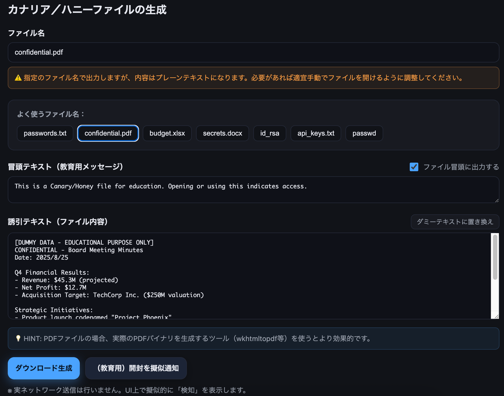

<!--
---
title: Canary File Generator
category: deception-security
difficulty: 1
description: Educational tool to generate Canary/Honey files and simulate access detection workflow.
tags: [canary, honeyfile, honeytoken, deception]
demo: https://ipusiron.github.io/canary-file-generator/
---
-->

# Canary File Generator - 教育用カナリア／ハニーファイル生成ツール


[](https://ipusiron.github.io/canary-file-generator/)

**Day054 - 生成AIで作るセキュリティツール100**

**Canary File Generator**は、教育用途として「重要そうに見えるファイル（カナリア／ハニーファイル）」を生成し、**誘引と検知**の違い、ハニートークンの意義を学べるツールです。

実ネットワーク送信は行わず、UI上の擬似通知で挙動を確認します。

## ⚠️ 重要な注意事項

**本ツールは教育目的専用です。**

- 生成されるすべての認証情報・パスワード・APIキーは**完全にダミー**です
- GitHubの自動セキュリティスキャンによる誤検出を避けるため、すべてのサンプルデータに`EXAMPLE`や`DUMMY`の明示的な標識を付けています
- 学習・研究目的以外での使用は推奨されません

---

## 🌐 デモページ

👉 **[https://ipusiron.github.io/canary-file-generator/](https://ipusiron.github.io/canary-file-generator/)**

ブラウザーで直接お試しいただけます。

---

## 📸 スクリーンショット



*カナリアファイルの"confidential.pdf"を生成*

---

## 機能

### ✅ カナリア/ハニーファイル生成
- **ファイル名指定**：任意のファイル名で生成（拡張子に応じた警告表示）
- **ファイル名プリセット**：`passwords.txt`、`confidential.pdf`、`budget.xlsx`、`secrets.docx`、`id_rsa`、`api_keys.txt`、`passwd`
- **冒頭テキスト（教育用メッセージ）**：ON/OFF切り替え可能、無効時はグレーアウト
- **誘引テキスト（ファイル内容）**：攻撃者を誘引するための偽情報
- **ダミーテキスト生成**：ランダムなLorem ipsum風テキストの自動生成
- **ダウンロード生成**：すべてプレーンテキスト形式（`.pdf`等の拡張子でも中身はテキスト）

### 📊 アクセス検知シミュレーション
- **擬似通知生成**：ファイル開封の模擬アラート
- **時間経過による色分け**：新しいアラート（赤）→古いアラート（グレー）
- **アラート管理**：個別削除、全削除機能
- **データ永続化**：ブラウザーのlocalStorageに保存

### 🎓 座学・教育機能
- **用語解説**：カナリアファイル、ハニーファイル、ハニートークンの違い
- **実戦シナリオ**：ハニーポット、マルウェア解析、ランサムウェア検出など
- **実務での活用方法**：本ツールで生成したファイルを実環境で使う際のガイド
- **動的HINT表示**：操作に応じた適切なヒント表示

> **注意**：実運用向けの監査・通知は別途実装が必要です。本ツールは教育・実験目的です。

---

## 用語の違い
- **ダミーファイル (Dummy File)**  
  代用品・テスト用。誘引・検知の仕掛けは持たない。
- **ハニーファイル (Honey File)**  
  攻撃者を誘引する「餌」。**検知は別仕掛け（監査ログや外部参照など）**に依存。
- **カナリアファイル (Canary File)**  
  「触れられたら検知できる」よう**仕掛けと誘引を組み合わせた**偽ファイル。
- **ハニートークン (Honey Token)**  
  ダミーの資格情報やキーなどの**偽データ**。**利用された瞬間に漏洩・盗難の確証**となる指標。

### ハニートークンの本質
それ自体はただのデータだが、**正規の文脈外で“使われた”時点で不正利用が確定**します。

例えば、ダミーAWSキーの利用検知など。

---

## 歴史的背景
- 偽情報で相手の行動を誘導・観測（軍事／スパイ）
- 1990年代以降のハニーポット研究
- 現代は Canarytokens 等で容易に利用可能

📖 **詳細な歴史** → [docs/HISTORY.md](docs/HISTORY.md)

---

## 実戦シナリオ

### 🎯 基本的な活用パターン

#### 1. ハニーポット・ハニーネット
- **誘引ファイル**: `password.txt`、`confidential.docx`、`backup_keys.zip`といった攻撃者にとって魅力的なファイル名
- **配置戦略**: 共有フォルダ、ユーザーデスクトップ、Webサーバーの `/backup/` ディレクトリなど目立つ場所
- **検知方式**: ファイルアクセス監視（auditd、Sysmon）、定期的なハッシュ値チェック
- **効果**: 攻撃者の手口（TTP）収集、侵入経路の特定、攻撃タイミングの把握

#### 2. マルウェア解析・動的解析
- **サンドボックス配置**: 仮想環境内にリアルなディレクトリ構造を模倣してカナリアファイルを配置
- **行動分析**: マルウェアが特定のファイル名やパスを探索する傾向を観測
- **情報収集対象**: 暗号化対象ファイルの選別基準、データ窃取の優先度判定
- **応用**: 新しいマルウェアファミリの挙動パターン分析、YARA ルール作成

#### 3. ランサムウェア早期検出
- **配置場所**: 各ドライブルート（C:\, D:\）、重要フォルダ（Documents、Pictures）
- **カナリアフォルダ**: 空のフォルダに複数のカナリアファイルを配置し、一括暗号化を検知
- **自動対応**: ファイル変更検知時の即座のネットワーク分離、プロセス停止
- **EDR連携**: 多くのEDRソリューションがカナリアファイル機能を内蔵

#### 4. サーバー・インフラ侵入検知
- **SSH関連**: `.ssh/id_rsa`、`.ssh/authorized_keys.bak`、`.ssh/config.backup`
- **設定ファイル**: `/etc/passwd.old`、`/etc/shadow.backup`、`.env.production`
- **データベース**: `database_backup.sql`、`users_export.csv`、`config.ini.bak`
- **Web系**: `.htpasswd`、`web.config.backup`、`database.php.old`
- **監視ポイント**: ファイルアクセス、コピー、移動、内容変更、権限変更

#### 5. 内部不正・特権乱用検知
- **役員情報**: `executives_contact.xlsx`、`board_meeting_notes.docx`
- **人事情報**: `salary_data.xlsx`、`employee_evaluation.pdf`
- **財務情報**: `financial_forecast.xlsx`、`audit_report.pdf`
- **技術情報**: `source_code_backup.zip`、`api_documentation.pdf`
- **アクセス制御**: 通常業務では不要なファイルへのアクセスを検知

#### 6. クラウド環境でのカナリア戦略
- **AWSキー**: 無効だが本物らしい形式の `credentials.ini`、`.aws/credentials`
- **Dockerファイル**: 環境変数に偽のAPI キーを含む `docker-compose.yml`
- **Kubernetes**: ConfigMap、Secret の偽データ
- **検知方式**: CloudTrail、VPC Flow Logs、GuardDuty との連携

#### 7. エンドポイント・デスクトップ
- **ユーザーフォルダ**: 各ユーザーの Documents、Desktop に重要そうなファイル
- **USB・外部媒体**: リムーバブルメディア経由での拡散検知
- **メール添付**: 偽の機密文書をメール添付で配布し、開封者を追跡
- **プリンター**: ネットワークプリンターの共有フォルダにカナリアファイル

#### 8. ネットワーク共有・ファイルサーバー
- **共有フォルダ**: 部門別共有フォルダ（\\server\HR\、\\server\Finance\）
- **アーカイブ**: 古いプロジェクトやバックアップが格納された領域
- **テンプレート**: 文書テンプレートフォルダに紛れ込ませる
- **検知**: SMB ログ、ファイルサーバーの監査ログと連携

#### 9. DevOps・開発環境
- **Git リポジトリ**: `.env.production`、`secrets.yaml`、`database.config`
- **CI/CD**: ビルドスクリプト内の偽の認証情報
- **コンテナレジストリ**: Docker イメージに仕込まれた偽設定
- **検知**: Git アクセスログ、Docker レジストリログ

#### 10. CTF・演習・教育
- **競技**: 偽フラグによる誤誘導、時間稼ぎ戦術
- **レッドチーム演習**: 攻撃チームの手口分析、防御チームの対応力評価
- **社内訓練**: セキュリティ意識向上のための「釣り」ファイル
- **学習効果**: 攻撃者視点の理解、検知手法の実践的習得

---

## 🛡️ 高度なケーススタディ

パスワードファイルを使った攻撃者の時間稼ぎ戦術や、デコイファイルによる行動誘導などの応用テクニックについて詳しく解説しています。

🔗 **詳細なケーススタディ** → [docs/ADVANCED_CASE_STUDIES.md](docs/ADVANCED_CASE_STUDIES.md)

---

## 拡張例
- **通知**：開封時に外部通信（教育ではUI擬似表示）
- **署名**：正規ファイルは署名付き／カナリアは未署名 → 真正性検証で判別
- **多層配置**：階層や種類別に行動分析

---

## 🏢 実務での活用方法

### ⚠️ 実務利用時の注意

本ツールで生成されるファイルは、GitHubの自動セキュリティスキャンやその他のセキュリティツールによる誤検出を避けるため、意図的に「偽物」であることが明示されています。

### 実際のハニーファイル／カナリアファイルとして使用する場合

**本ツールで生成したファイルをベースとして以下の編集を行ってください：**

1. **標識の削除**
   - `EXAMPLE_`、`DUMMY_`、`[EDUCATIONAL ONLY]`などの明示的な標識を削除

2. **リアルな内容への編集**
   - 組織名や部門名を実際のものに変更
   - サーバー名・IPアドレスを環境に合わせて調整
   - APIキーを実際のサービスの形式に合わせる（ただし無効なもの）
   - パスワードを実際のポリシーに準拠した形式に

3. **技術的な調整**
   - 適切なファイルパーミッション設定（SSH鍵：600、passwd：644など）
   - ファイル作成日時やメタデータの調整
   - 実際のディレクトリ構造に配置

4. **監視・通知の設定**
   - ファイルアクセス監視システムとの連携
   - アラート通知の仕組み構築
   - ログ分析システムとの統合

### 重要なポイント

- **本物らしさが鍵**：攻撃者が「本物」と判断するレベルまで編集することが効果的
- **環境に合わせる**：組織の実際のネーミング規則や技術スタックに合わせる
- **段階的配置**：重要度の異なる複数のファイルを戦略的に配置
- **定期的な見直し**：攻撃トレンドに合わせて内容を更新

---

## 📦 ダミーファイル作成のコマンド例

Linuxで指定サイズのダミーファイルを作成するコマンド例です。

🐧 **Linuxダミーファイル作成方法** → [docs/LINUX_DUMMY_FILES.md](docs/LINUX_DUMMY_FILES.md)

---

## 🧠 Advanced: 実運用での欺瞞技術

行動成形、TTP/IOC収集、Purple Team検証など、実運用環境でのより高度な欺瞞技術と戦略について詳しく解説しています。

🎯 **高度な欺瞞技術** → [docs/ADVANCED_DECEPTION.md](docs/ADVANCED_DECEPTION.md)

---

## ローカル開発
本ツールは静的なHTML/CSS/JavaScriptのみで構成されているため、ブラウザーで直接HTMLファイルを開いて動作します。

ローカルHTTPサーバーは必須ではありませんが、より本格的な開発環境が必要な場合は以下を使用できます。

### 【例】Python3
```bash
python3 -m http.server 8080
```

### 【例】Node.jsのhttp-serverライブラリ

```bash
npx http-server -p 8080
```

---

## 📁 ディレクトリー構成

```text
canary-file-generator/
├── .github/
│   └── SECURITY.md          # セキュリティポリシー（教育目的の明示）
├── assets/
│   └── screenshot.png       # スクリーンショット（プレースホルダー）
├── docs/                    # 詳細ドキュメント
│   ├── HISTORY.md          # 歴史的背景の詳細
│   ├── ADVANCED_CASE_STUDIES.md  # 高度なケーススタディ
│   ├── LINUX_DUMMY_FILES.md      # Linuxダミーファイル作成方法
│   └── ADVANCED_DECEPTION.md     # 高度な欺瞞技術
├── CLAUDE.md               # Claude Code用の開発ガイド
├── LICENSE                 # MITライセンス
├── README.md              # このファイル
├── index.html             # メインのHTMLファイル
├── script.js              # JavaScript（機能実装）
└── style.css              # CSS（スタイリング）
```

### 主要ファイルの役割

- **index.html**: 3つのタブ（生成、アラート、座学）を含むSPA構造
- **script.js**: ファイル生成、アラート管理、プリセット機能、HINT表示などの全機能
- **style.css**: ダークテーマベースのレスポンシブデザイン
- **.github/SECURITY.md**: GitHubセキュリティスキャンへの説明文

---

## 🔧 技術仕様

### フロントエンド
- **Pure HTML/CSS/JavaScript**: フレームワーク不使用のシンプル構成
- **レスポンシブデザイン**: モバイル・タブレット・デスクトップ対応
- **ダークテーマ**: CSS変数による統一されたカラーパレット
- **アクセシビリティ**: WAI-ARIAロール、キーボードナビゲーション対応

### データ管理
- **localStorage**: アラート履歴の永続化
- **sessionStorage**: 最後に生成したファイルのメタデータ保存
- **Blob API**: クライアントサイドファイル生成
- **No Backend**: 完全にクライアントサイドで動作

### セキュリティ対策
- **偽データ明示**: すべてのサンプルデータに`EXAMPLE_`、`DUMMY_`標識
- **教育用トークン**: `EDU_[timestamp]_[random]_FAKE`形式
- **GitHub Secret Scanning対応**: 実際のAPIキー形式を回避

---

## 📄 ライセンス

MIT License - 詳細は [LICENSE](LICENSE) をご覧ください。

---

## 🛠 このツールについて

本ツールは、「生成AIで作るセキュリティツール100」プロジェクトの一環として開発されました。  
このプロジェクトでは、AIの支援を活用しながら、セキュリティに関連するさまざまなツールを100日間にわたり制作・公開していく取り組みを行っています。

プロジェクトの詳細や他のツールについては、以下のページをご覧ください。  

🔗 [https://akademeia.info/?page_id=42163](https://akademeia.info/?page_id=42163)
